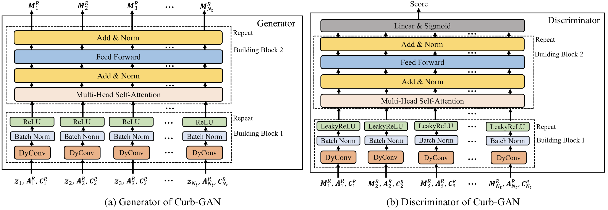

# Curb-GAN
The codes and data of paper "Curb-GAN: Conditional Urban Traffic Estimation through Spatio-Temporal Generative Adversarial Networks". 

This is the overview of Curb-GAN. The implementation is realized by Pytorch.

# Data Preparation
Since the whole dataset is huge, here we only provide sample datasets.

The sample data is located in data folder, please unzip data/speed_data.zip and data/inflow_data.zip and put the corresponding data files into traffic_speed_estimation/ and taxi_inflow_estimation/ folders, respectively.

# Requirements for Reproducibility
- Cuda 9.2
- pytorch 0.4.1
- Python 3.6.7
- Devices: NVIDIA GTX 1080 GPUs
- System: Ubuntu 16.04

# Training
Just take traffic speed estimation as an example:
1. `cd traffic_speed_estimation/`.
2. Running the codes: `python train.py`. (The parameters are defined in train.py)
3. The parameters of the trained model will be saved in to traffic_speed_estimation//CurbGAN_train.

The training process for taxi inflow estimation is similar.
